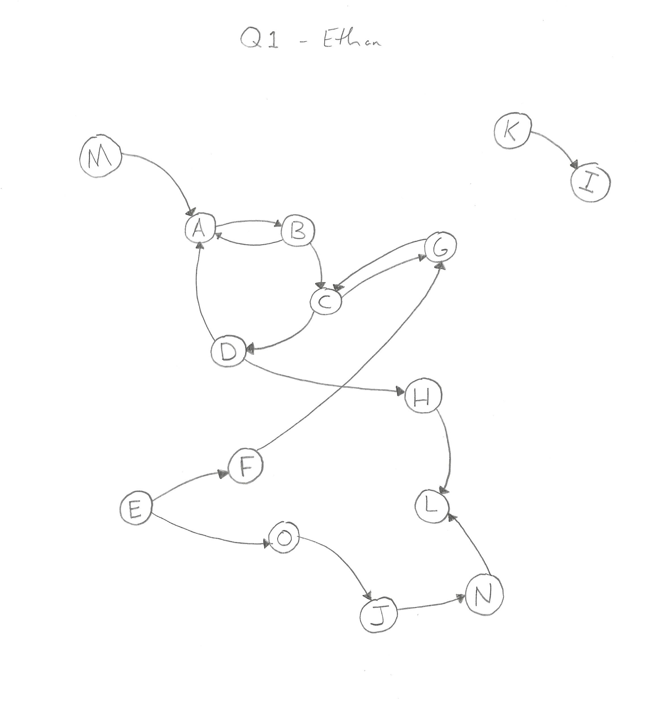
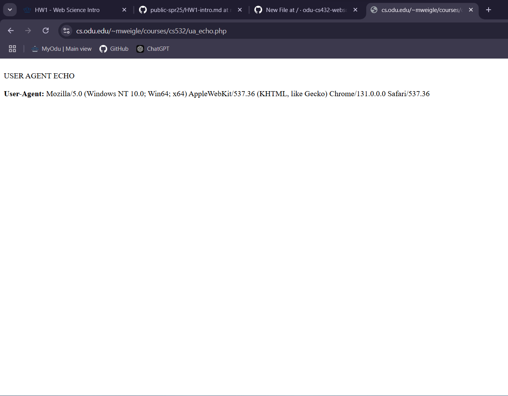
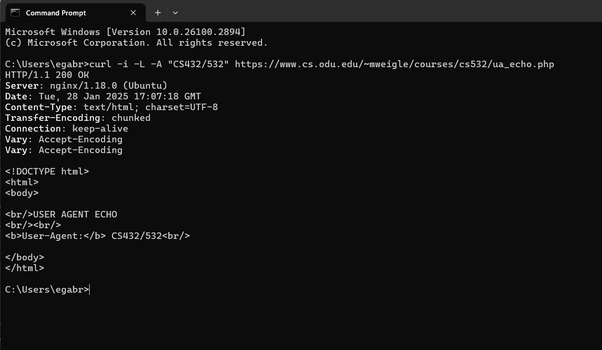
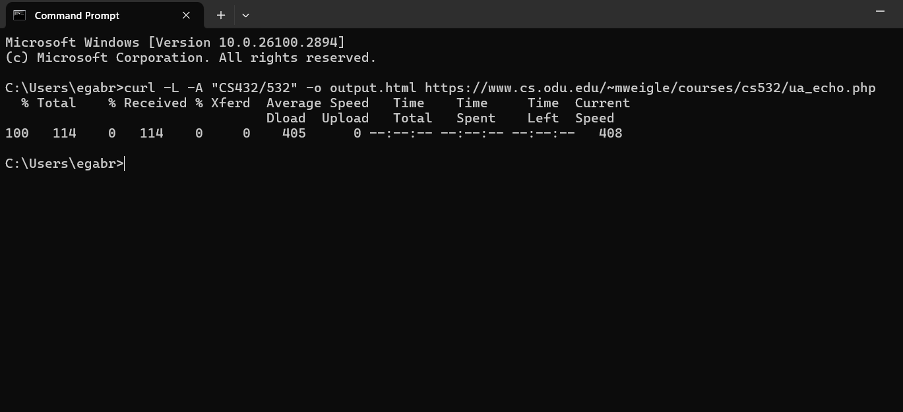
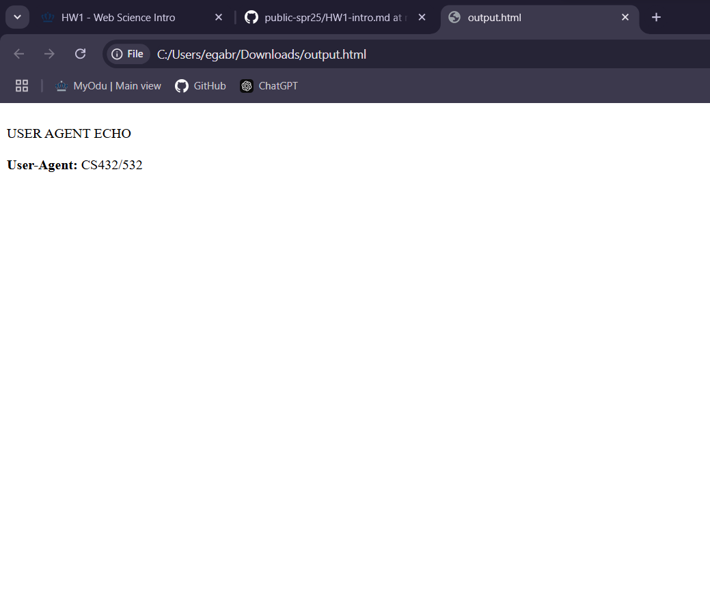

# HW1 - Web Science Intro
### Ethan Novak
### CS 432, Spring 2025
### Sun Feb 2, 2025 11:59pm

# Q1 Answer
For question 1, I drew a directed graph based on the following links:
```text
A --> B
B --> A
B --> C
C --> D
C --> G
D --> A
D --> H
E --> F
E --> O
F --> G
G --> C
H --> L
J --> N
K --> I
M --> A
N --> L
O --> J
```

My graph can be seen in the photo below. 



Now, I will list each node of the graph in alphabetical order and state their category (i.e., SCC, IN, OUT, Tendrils, Tubes, Disconnected).
```
A: SCC 
B: SCC 
C: SCC 
D: SCC 
E: Tendril (This can reach IN node F)
F: IN
G: SCC 
H: OUT
I: Disconnected
J: Tendril (can reach N, which connects to L)
K: Disconnected
L: Tendril (connected to N but isolated from the rest of the SCC)
M: IN
N: Tendril (leads to L, isolated)
O: Tendril (can reach F)
```
# Q2 Answer
a)
For part a, as the instructions state, I opened the following link and captured a screenshot:
https://www.cs.odu.edu/~mweigle/courses/cs532/ua_echo.php



b)
For part b, I used a single curl command to request the URI, show the HTTP response headers, follow any redirects, and change the User-Agent HTTP request field to "CS432/532".
My results are shown in the photo below. The `-i` flag includes the HTTP response headers.  The `-L` flag follows the redirects.  The `-A` flag changes the User-Agent to "CS432/532".



c)
For part c, I used a single curl command to request the URI, follow any redirects, change the User-Agent HTTP request field to "CS432/532", and save the HTML output to a file.
My results are shown in the photo below. The `-L` flag follows the redirects.  The `-A` flag changes the User-Agent to "CS432/532". The `-o` flag saves the HTML output file named `output.html`.



d)
For part d, I viewed the HTML output file that was produced by curl from part c in a web browser and captured a screenshot to include in my report.



# Q3 Answer


# References
* List of `curl` Options, <https://gist.github.com/eneko/dc2d8edd9a4b25c5b0725dd123f98b10>
