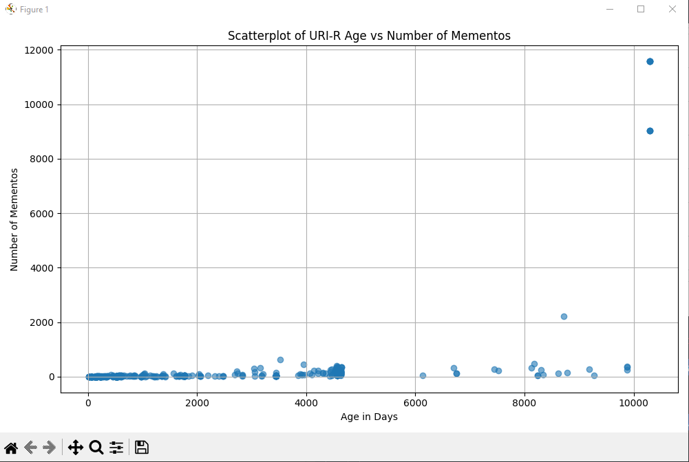

# HW4 - Web Archiving Part 2
### Ethan Novak
### CS 432, Spring 2025
### Sunday March 16, 2025 11:59pm

# Q1 Answer

For this question, I created a Python script that processes the JSON files and creates a scatterplot that illustrates the earliest memento from each TimeMap.  The script reads each JSON file that is in the 'timemaps' folder, extracts the earliest memento of the URI, calculates its age in days, and counts the total number of mementos. The script then creates a scatterplot using matplotlib to showcase the age of each URI-R on the x-axis and number of mementos for that URI-R on the y-axis. The script is in the file `datetimeGraph.py`, and it can also be found below:

```
import os
import json
import datetime
import matplotlib.pyplot as plt

json_folder_path = 'timemaps'

if not os.path.exists(json_folder_path):
    print(f"Error: The folder '{json_folder_path}' does not exist.")
else:
    uri_data = []

    current_date = datetime.datetime.now(datetime.timezone.utc)

    for filename in os.listdir(json_folder_path):
        if filename.endswith('.json'):
            file_path = os.path.join(json_folder_path, filename)

            try:
                with open(file_path, 'r') as f:
                    if f.readable():
                        f.seek(0) 
                        data = json.load(f)
                    else:
                        print(f"Skipping empty file: {filename}")
                        continue

                if 'mementos' in data and 'list' in data['mementos'] and len(data['mementos']['list']) > 0:
                    uri_r = data['original_uri']

                    mementos = data['mementos']['list']
                    earliest_memento = min(mementos, key=lambda x: x['datetime'])
                    earliest_memento_datetime = datetime.datetime.strptime(earliest_memento['datetime'], '%Y-%m-%dT%H:%M:%SZ')

                    earliest_memento_datetime = earliest_memento_datetime.replace(tzinfo=datetime.timezone.utc)

                    age_in_days = (current_date - earliest_memento_datetime).days

                    num_mementos = len(mementos)

                    uri_data.append((age_in_days, num_mementos))

            except json.JSONDecodeError as e:
                print(f"Skipping invalid JSON file: {filename} ({str(e)})")
            except Exception as e:
                print(f"An error occurred with file {filename}: {str(e)}")

    if uri_data:
        ages = [data[0] for data in uri_data]
        num_mementos = [data[1] for data in uri_data]

        plt.figure(figsize=(10, 6))
        plt.scatter(ages, num_mementos, alpha=0.6)
        plt.title('Scatterplot of URI-R Age vs Number of Mementos')
        plt.xlabel('Age in Days')
        plt.ylabel('Number of Mementos')
        plt.grid(True)
        plt.tight_layout()
        plt.show()
    else:
        print("No valid data to plot.")

```
After the script is ran, the following scatterplot is displayed:



Q: What can you say about the relationship between the age of a URI-R and the number of its mementos?

A: Overall, there does not seem to be a strong relationship between the age of a URI-R and the number of its mementos. Almost all URI-Rs have under 4000 mementos, and these are illustrated is the near the bottom of the y-axis. Of course, there are a few URI-Rs that have a very high number of mementos. The majority of data points are in the lower left corner of the scatterplot, indicating that most URIs are relatively young and have few archived versions. 

Q: What URI-R had the oldest memento? Did that surprise you?

A: Based on the scatterplot, the oldest URI-R appears to be just under 10,000 days old. This is approximately between 25-27 years old. This did not surprise me because some websites contain links that have been around since the start of the internet. 

Q: How many URI-Rs had an age of < 1 week, meaning that their first memento was captured the same week you collected the data?

A: Based on the scatterplot, there are numerous data points that are very close to 0 on the x-axis. This indicates that these URIs were recently created or archived. By carefully looking at the scatterplot, I believe that there are approximately 40-50 URI-Rs with an age less than 1 week. 

# Q2 Answer

# References
