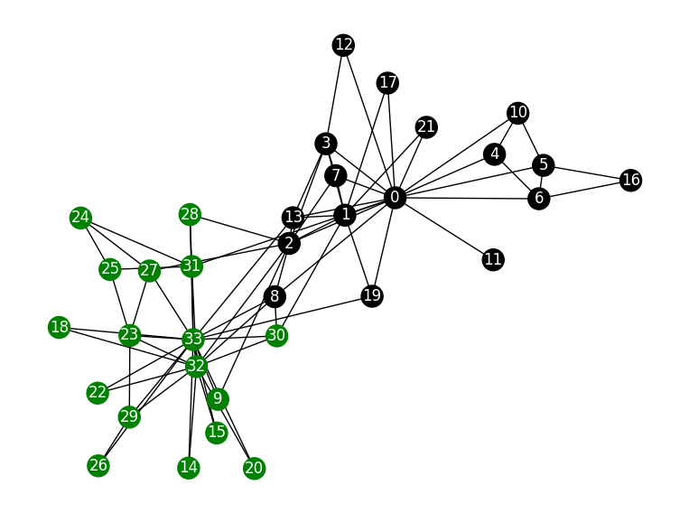
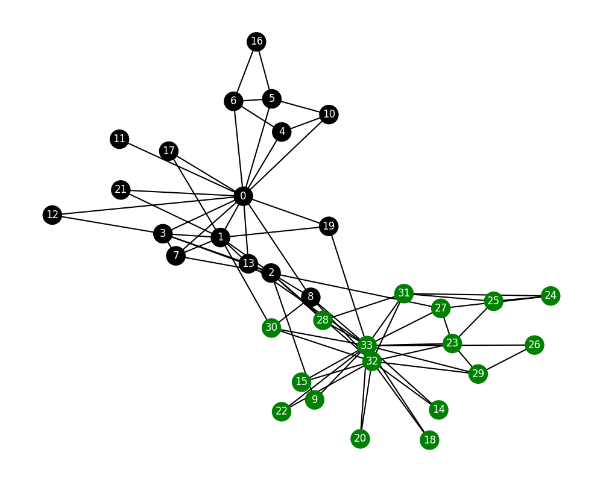
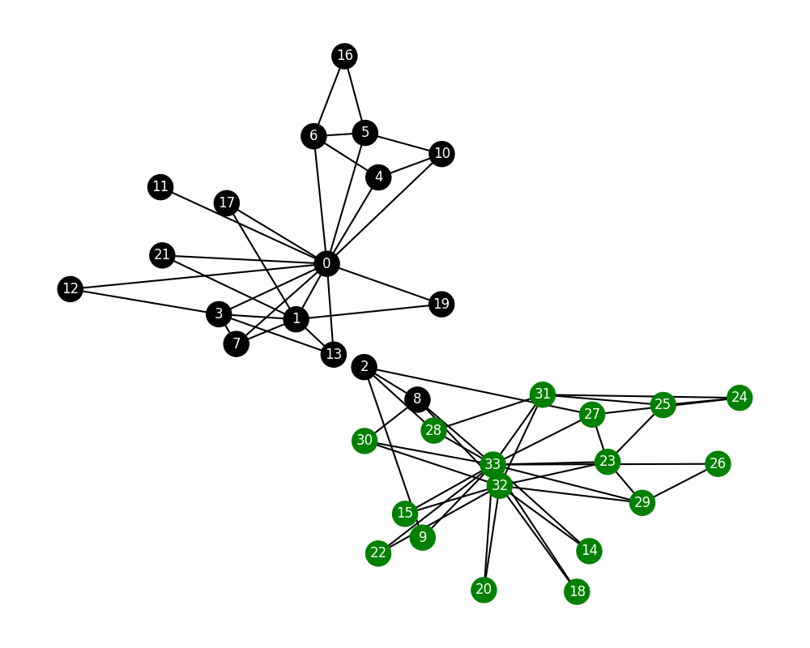

# HW5 - Graph Partitioning
### Ethan Novak
### CS 432, Spring 2025
### Sunday March 23, 2025 11:59pm

# Q1 Answer

I created a Python script that draws the Karate Club graph. The script loads the Karate Club graph directly from NetworkX. The script then checks if the nodes belong to John A's faction or Mr. Hi's faction. If the node belongs to Mr. Hi, the node is colored black, and if the node belongs to John A, the node is colored green. The graph is drawn with nx.draw(), and the graph is displayed with matplotlib. 

```
# This script can also be found at HW5/q1.py.

import networkx as nx
import matplotlib.pyplot as plt

graph = nx.karate_club_graph()

faction_colors = []

for node in graph.nodes:
    if graph.nodes[node]['club'] == 'Mr. Hi':
        faction_colors.append('black') 
    else:
        faction_colors.append('green')  # John A

pos = nx.spring_layout(graph)
nx.draw(graph, pos=pos, node_color=faction_colors, with_labels=True, font_color="white")
plt.title("Karate Club Graph (John A & Mr. Hi)")
plt.show()

```

The graph that the script generates can be seen below:



Q: How many nodes eventually go with John and how many with Mr. Hi?

A: 17 nodes correspond with John A, and 17 nodes also correspond with Mr. Hi. 

# Q2 Answer

As the instructions state, I implemented the Girvan-Newman algorithm to show that the result of the split could have been predicted by the weighted graph of social interactions. The script containing the algorithm can be found below:

```
import networkx as nx
import matplotlib.pyplot as plt
import numpy as np
from copy import deepcopy

def girvan_newman_step(graph):
    betweenness = nx.edge_betweenness_centrality(graph)
    max_betweenness = -1
    edge_to_remove = None
    
    for edge, betweenness_value in betweenness.items():
        if betweenness_value > max_betweenness:
            max_betweenness = betweenness_value
            edge_to_remove = edge
    
    G_new = graph.copy()
    G_new.remove_edge(*edge_to_remove)
    
    return edge_to_remove, G_new, max_betweenness

def visualize_graph(graph, iteration=None, removed_edge=None, betweenness=None):
    faction_colors = []
    for node in graph.nodes:
        if graph.nodes[node]['club'] == 'Mr. Hi':
            faction_colors.append('black') 
        else:
            faction_colors.append('green')  # John A
    
    global pos
    if 'pos' not in globals():
        pos = nx.spring_layout(graph, seed=42)
    
    plt.figure(figsize=(10, 8))
    
    nx.draw(graph, pos=pos, node_color=faction_colors, with_labels=True, font_color="white", node_size=500, width=1.5)
    
    if iteration is not None and removed_edge is not None and betweenness is not None:
        plt.title(f"Iteration {iteration}: Removed edge {removed_edge} (Betweenness: {betweenness:.4f})")
    else:
        plt.title("Karate Club Graph (John A & Mr. Hi)")

    if iteration is not None:
        plt.savefig(f"iteration_{iteration}.png")
    else:
        plt.savefig("original_graph.png")
    
    plt.show()

def count_components(graph):
    return nx.number_connected_components(graph)

def main():
    G = nx.karate_club_graph()
    visualize_graph(G)
 
    iteration = 1
    current_graph = G.copy()
    num_components = count_components(current_graph)
    
    while num_components < 2:
        print(f"Iteration {iteration}")
        edge_removed, current_graph, betweenness = girvan_newman_step(current_graph)
        visualize_graph(current_graph, iteration, edge_removed, betweenness)
        
        num_components = count_components(current_graph)
        print(f"Number of components: {num_components}")
        print(f"Removed edge: {edge_removed} with betweenness: {betweenness:.4f}")
        
        iteration += 1
    
    print(f"\nThe graph was split after {iteration-1} iterations.")
    
    components = list(nx.connected_components(current_graph))
    
    mr_hi_faction = set()
    john_a_faction = set()
    
    for node in G.nodes():
        if G.nodes[node]['club'] == 'Mr. Hi':
            mr_hi_faction.add(node)
        else:
            john_a_faction.add(node)
    
    if len(components) == 2:
        comp1, comp2 = components
        
        match1 = len(comp1.intersection(mr_hi_faction)) + len(comp2.intersection(john_a_faction))
        match2 = len(comp1.intersection(john_a_faction)) + len(comp2.intersection(mr_hi_faction))
        
        total_nodes = len(G.nodes())
        accuracy = max(match1, match2) / total_nodes
        
        print(f"Accuracy of the split compared to actual factions: {accuracy:.2%}")

if __name__ == "__main__":
    main()
```

The script first loads the Zachary's Karate Club graph, then it visualizes the original graph and runs the Girvan-Newman algorithm until the graph splits into two components. After this, the algorithm checks how well the detected communities match the actual factions and calculates the accuracy of the split. 

The `visualize_graph` function takes several parameters. The parameters are `graph`, which is of nx.Graph data type and is used to visualize the graph, `iteration`, which is of integer data type and is used to display the current iteration as an integer, `removed_edge`, which is a tuple and is used to represent the most recent edge that was removed, and `betweenness`, which is a float and is used to represent the betweenness of the removed edge. This function first assigns colors based on faction. After this, it gets the position layout, draws the graph, adds the title with iteration information, and saves each figure as a .png image. 

The `count_components` function takes `graph` as a parameter, which is of nx.Graph data type. This parameter is the graph that needs to be analyzed. The function returns an integer representing the number of connected components. 

When the script is run, it generates images of the graph as it splits. In order, the images of the graph splitting are as follows:







Q: How many iterations did it take to split the graph?

A: It took 11 iterations to split the graph. The accuracy of the split compared to the actual factions was 94.12%. This high level of accuracy indicates that the mathematical model successfully represents reality. After the graph was split, the graph on the left contained 15 'Mr. Hi' nodes and 0 'John A' nodes, and the graph on the right contained 2 'Mr. Hi' nodes and 17 'John A' nodes. 

The algorithm was run until the graph was split into two components. Here are the details of each iteration:

|Iteration | Number of components | Removed edge | Betweenness |
|---------:|--------:|--------:|--------:|
|1 | 1 | (0, 31) | 0.1273 |
|2 | 1 | (0, 2) | 0.1192 |
|3 | 1 | (0, 8) | 0.1378 |
|4 | 1 | (13, 33) | 0.1462 |
|5 | 1 | (19, 33) | 0.2197 |
|6 | 1 | (2, 32) | 0.1786 |
|7 | 1 | (1, 30) | 0.2560 |
|8 | 1 | (1, 2) | 0.1947 |
|9 | 1 | (2, 3) | 0.1919 |
|10 | 1 | (2, 7) | 0.2545 |
|11 | 2 | (2, 13) | 0.5080 |

# Q3 Answer

Q: Did all of the same colored nodes end up in the same group? If not, what is different?

A: In both the Girvan Newman graph and the Karate Club graph, I colored the nodes in black and green. When comparing the two graphs, all the nodes remain the same colors. In other words, in the Karate Club graph, nodes 26, 14, 20, 15, 29, 9, 22, 32, 30, 33, 23, 18, 27 31, 25, 28, and 24 are green, and nodes 0, 1, 2, 8, 19, 11, 6, 5, 4, 16, 10, 21, 3, 7, 13, 17, and 12 are black; also in the Girvan Newman graph, nodes 26, 14, 20, 15, 29, 9, 22, 32, 30, 33, 23, 18, 27 31, 25, 28, and 24 are green, and nodes 0, 1, 2, 8, 19, 11, 6, 5, 4, 16, 10, 21, 3, 7, 13, 17, and 12 are black. However, after the split, not all the same colored nodes ended up in the same group. In the Girvan Newman split graph, node 8 (black) is connectd to the green community (specifically connecting to nodes 30, 32, 33, and 28). Node 2 (black) also serves as a bridge between the communities. The main difference is that in the Girvan Newman algorithm's result, node 8 appears to be more integrated with the black-node community. 

# Q4 Answer (Extra Credit)

## If the clubs split into 3 groups, this is most likely how the graph would look: 

Group 1 would be centered around node 0. This group would consist of nodes 0, 1, 3, 4, 5, 6, 7, 10, 11, 12, 13, 16, 17, 19, 21, which would comprise the network of black nodes. 

Group 2 would be centered around nodes 32 and 33. This group would consist of nodes 9, 14, 15, 18, 20, 22, 23, 25, 26, 27, 29, 30, 31, 32, 33, which would comprise the network of green nodes.

Group 3 would be bridge nodes, such as nodes 2, 8, and 28, which would connect the two main communities.

## If the clubs split into 4 groups, this is most likely how the graph would look: 

Group 1 would be cenetered around node 0, and it would consist of black nodes 0, 1, 3, 4, 5, 6, 7, 10, 11, 17, 19, 21.

Group 2 would be a secondary black cluster consisting of nodes 12, 13, and 16. 

Group 3 would be the core green cluster, consisting of nodes 9, 14, 15, 18, 20, 22, 23, 25, 26, 27, 29, 32, 33.

Group 4 would be bridge nodes and the secondary green cluster. This group would consist of nodes 2, 8, 24, 28, 30, 31.

## If the clubs split into 5 groups, this is most likely how the graph would look:

Group 1 would be centered around node 0, and it would consist of nodes 0, 1, 3, 4, 5, 6, 7, 10, 11.

Group 2 would be the secondary black node cluster, consisting of nodes 12, 13, 16, 17, 19, 21.

Group 3 would be the main green cluster, consisting of nodes 9, 14, 15, 18, 20, 22, 32, 33. This cluster would be centered around nodes 32 and 33. 

Group 4 would be the secondary green cluster, consisting of nodes 23, 25, 26, 27, 29.

Finally, group 5 would be the bridge nodes cluster, consisting of the nodes that connect the communities. This group would be comprised of nodes 2, 8, 24, 28, 30, 31.

# References

* Zachary's Karate Club, <https://en.wikipedia.org/wiki/Zachary%27s_karate_club>

* How to Implement the Girvan-Newman Algorithm, <https://memgraph.github.io/networkx-guide/algorithms/community-detection/girvan-newman/>

* Girvan–Newman — The Clustering Technique in Network Analysis Part 1, <https://medium.com/analytics-vidhya/girvan-newman-the-clustering-technique-in-network-analysis-27fe6d665c92>
