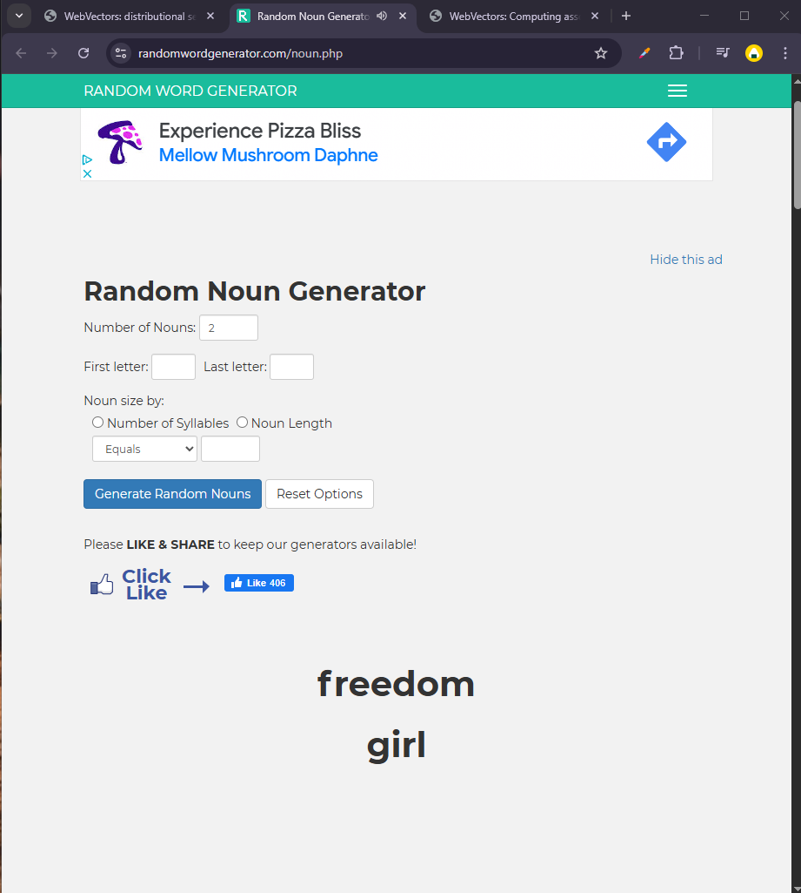
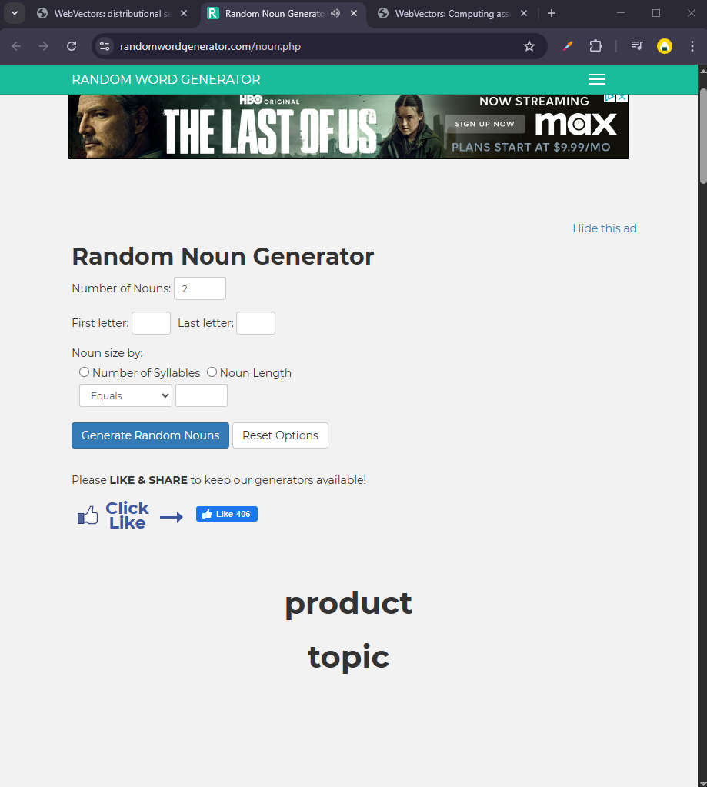
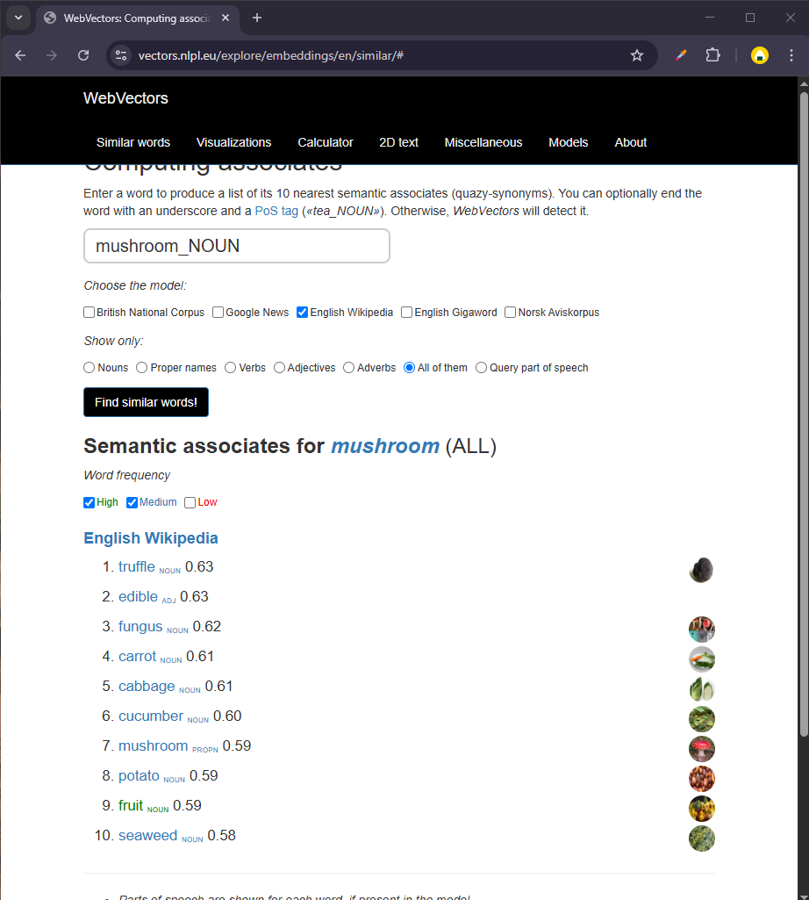

# HW8 - Exploring LLMs
### Ethan Novak
### CS 432, Spring 2025
### Sunday April 20, 2025 11:59pm

# Q1 Answer

## The two random pairs of words that I generated are "freedom girl" and "product topic". Here are the images:

# For part 1:

### Random word one:


### Random word two:


## The semantic similarity between the pairs can be seen below:


# For part 2:
## My randomly generated word was "mushroom". Additionally, my results can be seen below:


The top words are:
1. truffle
2. edible
3. fungus
4. carrot
5. cabbage
6. cucumber
7. mushroom
8. potato
9. fruit
10. seaweed

Furthermore, when I click on the highest related word (truffle), it does in fact show that the top related word is the original word (truffle's highest related word is "mushroom"). 

# For part 3:


# Q2 Answer
The 5 interesting ChatGPT prompts that I chose for the answer to this question are:

1. Write me a step-by-step guide for asking for a pay rise at work.
2. Give me a detailed guide on the technological evolution between PlayStation One and PlayStation 2.
3. Write an itinerary for my family’s 5-day trip to Rome, making a list of 10 additional activities.
4. Write a 16-bar pop chord progression in the key of E.
5. Create a meal plan aimed at young adults to help them eat more healthily.

Additionally, I found these prompts on the web article titled "Check These 100 Powerful ChatGPT Prompts for Every Situation". The web article can be found here: https://growthtribe.io/blog/chatgpt-prompts/

Here are ChatGPT's responses to each of the interesting prompts:

## Q: Write me a step-by-step guide for asking for a pay rise at work.
## Response:
```
Asking for a pay rise can feel like a daunting task, but if you're prepared and approach the conversation thoughtfully, you can increase your chances of success. Here's a step-by-step guide to help you:

### Step 1: **Evaluate Your Current Situation**
Before making any request, take a moment to reflect on your current job, salary, and performance. Consider the following:
- **Your role and responsibilities**: Have they grown or changed since you were hired? Are you doing more than you were originally hired to do?
- **Your achievements and contributions**: Have you accomplished significant goals or contributed to the company's success? Gather evidence of your impact, such as successful projects or performance reviews.
- **Company performance**: Is the company in a good financial position? If the company is struggling, it may be harder to get a raise.
- **Industry standards**: Research the average salary for your role in your industry and region to understand where you stand. Websites like Glassdoor or Payscale can provide useful benchmarks.

### Step 2: **Choose the Right Time**
Timing is crucial when asking for a raise. Consider the following:
- **Company performance**: If the company has just had a successful quarter or year, it’s a good time to bring it up. Avoid asking when the company is experiencing financial difficulties or layoffs.
- **Your manager’s schedule**: Don’t bring it up when your manager is stressed or busy. Aim for a time when they’re less likely to be distracted and can give you their full attention.
- **Personal performance**: Ask for a raise after a major accomplishment or when you've consistently exceeded expectations. If you've recently completed a successful project or received positive feedback, it’s a good opportunity to present your case.

### Step 3: **Prepare Your Case**
Before you approach your manager, gather evidence to support your request. This will help you present a strong case:
- **Quantify your contributions**: List the specific ways you’ve added value to the company. Use numbers, metrics, and examples to highlight your achievements. For instance, “I increased sales by 20% last quarter” or “I managed a team that completed a project two weeks ahead of schedule.”
- **Highlight your skill growth**: Show how your skills have improved over time, and how you’ve taken on more responsibility.
- **Market research**: Refer to industry salary benchmarks to demonstrate that your request is reasonable given your role and experience.
- **Your own needs**: If appropriate, you can mention personal reasons for needing a raise (e.g., increased living expenses or a change in financial goals), though focusing on professional reasons tends to be more effective.

### Step 4: **Request a Meeting**
Request a formal meeting with your manager. You can do this via email or a quick conversation. Here’s an example of how to word your request:
> “Hi [Manager’s Name], I’d like to schedule a meeting to discuss my role and compensation. Are you available next week to chat? I’d appreciate the chance to review my progress and contributions.”

This shows professionalism and sets the stage for a focused discussion.

### Step 5: **Make Your Request**
In the meeting, be confident and clear. Here's a structure you can follow:
1. **Express appreciation**: Start by thanking your manager for their time and support.
   - Example: "I really appreciate the opportunity to work here and all the guidance I've received from you."
   
2. **Present your case**: Highlight your achievements, growth, and market research.
   - Example: "Over the past year, I’ve taken on additional responsibilities, such as [list responsibilities]. I’ve also [mention specific achievements], which has helped the team achieve [mention outcomes]. Based on this, I believe it’s appropriate to discuss adjusting my salary to reflect these contributions."
   
3. **State your request clearly**: Be direct about your expectation.
   - Example: “Based on my contributions and the market data, I would like to request a raise of [specific amount or percentage].”

4. **Be open to discussion**: Your manager might ask for more information or give you a counteroffer. Stay flexible and open to feedback.

### Step 6: **Prepare for Different Outcomes**
Be ready for any response:
- **If they agree**: Great! Express your gratitude and confirm any next steps (e.g., when the new salary will take effect).
- **If they ask for time to think**: Be patient. It’s common for managers to need time to consider the request and consult with HR or other decision-makers.
- **If they decline**: Stay calm and ask for feedback on what you can do to be considered for a raise in the future. You might also ask for a timeline for when the company will be in a better position to grant the raise.

### Step 7: **Follow Up**
If the discussion was positive but the raise is delayed or contingent on further performance, make sure to follow up as needed. Set clear goals with your manager and request a future meeting to revisit the conversation.

If your request is declined, don’t be discouraged. Use the feedback to set new goals, and in a few months, you can revisit the conversation with an even stronger case.

### Final Tips:
- **Stay professional**: Keep the conversation respectful and professional, even if the outcome isn’t what you hoped for.
- **Be prepared for a “no”**: Not every request will be granted, but it’s a chance to learn and improve for next time.
- **Confidence matters**: Be confident in your worth, but be realistic about your request.

By being well-prepared and approaching the conversation with confidence and professionalism, you’ll increase your chances of getting a pay rise.
```

## Q: Give me a detailed guide on the technological evolution between PlayStation One and PlayStation 2.
## Response:
```
The technological evolution between the **PlayStation One (PS1)** and **PlayStation 2 (PS2)** was a monumental leap in the gaming world, not just in terms of hardware capabilities, but also in terms of multimedia features, game design, and user experience. The PS2’s technological advancements over the PS1 helped cement its position as one of the most successful gaming consoles of all time.

Let’s break this down across several key aspects:

### 1. **CPU (Central Processing Unit)**

#### **PS1:**
- **Processor**: The PS1 used the **MIPS R3000A** chip, running at 33.868 MHz.
- **Architecture**: It was a 32-bit processor, capable of handling basic polygon rendering and audio, which was revolutionary at the time.
- **Performance**: The PS1's CPU allowed for basic 3D graphics, but it struggled with higher polygon counts and complex environments, especially in real-time rendering. Its performance was sufficient for most early 3D games.

#### **PS2:**
- **Processor**: The PS2 introduced the **Emotion Engine** (EE), a custom-designed 128-bit CPU developed by Sony in collaboration with Toshiba and IBM. The Emotion Engine had a clock speed of **294 MHz** in its base version, but it was capable of handling more tasks simultaneously due to its more efficient multi-core architecture.
- **Architecture**: The PS2 used a **128-bit** architecture, which represented a massive leap from the 32-bit PS1. It was designed not just for faster processing but also for handling more complex geometry and physics in games.
- **Performance**: The PS2's Emotion Engine had a peak processing power of over 6.2 GFLOPS (Giga Floating Point Operations Per Second), which was more than 100 times faster than the PS1's processing power. This allowed for much more detailed environments, real-time physics, and smoother gameplay with higher polygon counts.

### 2. **Graphics (GPU - Graphics Processing Unit)**

#### **PS1:**
- **GPU**: The PS1 used the **Graphics Synthesizer (GS)** with a processing speed of **150 MHz**.
- **Graphics Output**: The PS1 could output graphics at a resolution of **320×240** pixels (standard), with some games running at **640×480** in an interlaced format. The PS1’s graphics were primarily focused on basic 3D rendering with textures, but the system struggled to render more complex textures and effects due to its limited graphics memory (1 MB VRAM).
- **Polygons**: The PS1 could render roughly **360,000 polygons per second**, depending on the game and optimization.

#### **PS2:**
- **GPU**: The PS2 used the **Graphics Synthesizer (GS)**, but it was an improved version capable of handling more advanced techniques. It featured a **147 MHz** clock speed and an advanced system of **vector processing**.
- **Graphics Output**: The PS2 could render at resolutions up to **720p** (progressive scan) in certain titles, with the common resolution being **480i** (interlaced) or **480p** (progressive) for higher-end displays.
- **Polygons**: The PS2 was capable of rendering **6 million polygons per second** under optimal conditions. With its hardware optimizations, games could feature much more detailed and complex models than what was possible on the PS1.
- **Lighting & Effects**: The PS2 supported a wide range of lighting and shading effects, including **bump mapping**, **reflections**, **real-time lighting**, and **advanced texture filtering**. This gave developers the ability to create much more immersive environments.

### 3. **Memory (RAM and VRAM)**

#### **PS1:**
- **Main RAM**: The PS1 had **2 MB of main RAM**.
- **Video RAM (VRAM)**: The PS1 had **1 MB of VRAM**, which limited its ability to handle large textures or complex visual effects.
- **Sound**: The PS1 had **24 channels of ADPCM audio**, which was capable of producing CD-quality sound, but it was limited in terms of handling multiple sound effects and high-quality music simultaneously.

#### **PS2:**
- **Main RAM**: The PS2 came with **32 MB of main RAM** (increased 16-fold compared to the PS1), allowing it to handle more complex game logic, larger levels, and more detailed AI.
- **Video RAM (VRAM)**: The PS2 had **4 MB of dedicated VRAM** for handling high-quality textures and graphics.
- **Sound**: The PS2 supported **128 channels of ADPCM audio**, as well as more advanced sound processing, allowing for superior quality in sound design, voice acting, and dynamic music.

### 4. **Optical Drive (Disc Format)**

#### **PS1:**
- **Disc Format**: The PS1 used **CD-ROMs** for games, which could store up to **700 MB** of data. This was a big leap from the cartridge-based systems, allowing for games with more expansive worlds, music, and cut-scenes.
- **Speed**: The PS1’s CD-ROM drive had a data transfer rate of **150 KB/s**.

#### **PS2:**
- **Disc Format**: The PS2 was compatible with **DVD-ROMs**, a new disc format at the time, which could hold up to **4.7 GB** of data (or more with dual-layer discs). This allowed for larger games, with higher-quality video, audio, and textures.
- **Backward Compatibility**: The PS2 could also play PS1 CDs, making it backward-compatible with older games (a key selling point during its early years).
- **Speed**: The PS2's DVD drive had a transfer rate of **300 KB/s**, which was roughly double the speed of the PS1’s CD-ROM drive, and this contributed to faster load times and larger, more expansive game worlds.

### 5. **Audio**

#### **PS1:**
- The PS1 had **24-bit audio processing** capabilities, with **24 channels** of sound for music, effects, and voice. It could deliver relatively high-quality audio, but there was limited space on CDs, meaning that many PS1 games used compressed audio formats.

#### **PS2:**
- The PS2 featured **128-bit audio** processing, with **128 channels** for music, sound effects, and voice, providing a richer audio experience. This allowed for more intricate and dynamic soundtracks, better voice acting, and higher-quality in-game audio.

### 6. **Backward Compatibility**

#### **PS1:**
- The PS1 was not backward-compatible with any prior Sony console games.

#### **PS2:**
- The PS2 introduced backward compatibility, allowing users to play **most PS1 games** on the new console. This was a significant feature for gamers who had invested in PS1 games and wanted to keep playing them.

### 7. **Graphics and Game Design Advancements**

#### **PS1:**
- The PS1 was a pioneer in 3D gaming, but its technology was still quite limited in comparison to modern standards. Early PS1 games, such as **"Crash Bandicoot"** and **"Final Fantasy VII"**, used a lot of pre-rendered backgrounds and relatively simple 3D models.

#### **PS2:**
- With the PS2, developers could push the envelope on game design. Titles like **"Grand Theft Auto III"**, **"Metal Gear Solid 2"**, and **"Final Fantasy X"** showed off the capabilities of the console with vast open worlds, fully 3D environments, and cinematic cut-scenes.
- The PS2 supported **motion blur**, **real-time shadows**, **bump-mapping**, **normal mapping**, and more advanced physics. These advancements made for much more realistic and immersive gameplay.

### 8. **Multimedia Capabilities**

#### **PS1:**
- The PS1 was primarily a gaming machine, with limited multimedia capabilities.

#### **PS2:**
- The PS2 was marketed as an **all-in-one entertainment device**. It was not only a gaming console but also a **DVD player**, which was a massive selling point at the time, as many people were looking to purchase DVD players.
- The PS2 supported **DVD-Video playback**, making it an attractive option for those wanting to watch movies in high quality on their television. This multimedia functionality helped increase the PS2’s popularity beyond gaming enthusiasts.

### 9. **Controller Design**

#### **PS1:**
- The PS1 controller was simple but effective, with the familiar **D-pad**, **four action buttons (Triangle, Circle, Cross, Square)**, **Start and Select buttons**, and **shoulder buttons** (L1/R1). The controller didn’t have analog sticks (which were added in later revisions with the **DualShock** controller).
- The **DualShock** added **vibration feedback** and **analog joysticks**, which improved the overall gaming experience.

#### **PS2:**
- The PS2 retained the basic design of the PS1 controller but made it more ergonomic. The **DualShock 2** added **analog pressure-sensitive buttons**, allowing for a greater range of input, such as varying the strength of a jump or throttle in racing games.
- The controller was wired, and there were no major changes to the overall layout or feel, but the analog button input gave more nuanced control in certain games.

### 10. **Online and Connectivity**

#### **PS1:**
- The PS1 did not have much in the way of online features. Some games, such as **"Twisted Metal: Small Brawl"**, featured local multiplayer

 via a serial cable, but this was a very limited form of online play.

#### **PS2:**
- The PS2 introduced **online gaming** through an **Ethernet port** and **modem**, though online play wasn’t as widespread or standardized as it would be in later generations. The **PlayStation Network** didn’t exist yet, but many games (such as **"SOCOM: U.S. Navy SEALs"** and **"Final Fantasy XI"**) offered online multiplayer experiences.
- The PS2 also supported memory card data transfer between systems, and there were limited accessories like the **PlayStation EyeToy** for camera-based gaming.

---

### Conclusion:
The transition from PS1 to PS2 was a huge leap forward in terms of processing power, graphics, memory, and multimedia functionality. The PS2 didn’t just represent a technical upgrade; it changed the landscape of gaming with cinematic experiences, immersive 3D worlds, and the ability to play DVDs. The PS2's incredible library of games, alongside its technological advancements, made it a pivotal moment in gaming history, solidifying its place as one of the best-selling consoles ever.
```

## Q: Write an itinerary for my family’s 5-day trip to Rome, making a list of 10 additional activities.
## Response:
```
That sounds like an amazing trip! Here’s a 5-day itinerary for your family’s visit to Rome, along with 10 additional activities you can choose from depending on your preferences:

### **Day 1: Classic Rome**
**Morning:**
- **Colosseum**: Start your trip with one of the most iconic landmarks. Book skip-the-line tickets to avoid the long queues.
- **Roman Forum & Palatine Hill**: After exploring the Colosseum, head over to these nearby ancient ruins to experience the heart of ancient Roman life.

**Lunch**: Grab a bite at a local pizzeria or trattoria. **Pizzeria ai Marmi** (near Trastevere) is a popular spot for locals.

**Afternoon:**
- **Capitoline Hill & Museums**: Visit the Capitoline Museums, which house an extensive collection of classical art and history.
- **Piazza Venezia**: Explore this large central square, and take a quick photo by the famous **Altare della Patria** (the Victor Emmanuel II Monument).

**Evening**: 
- **Pantheon**: Enjoy the magic of this well-preserved ancient building. It's especially beautiful at sunset.
- **Piazza Navona**: End your evening in this beautiful square, famous for its fountains and street artists.

---

### **Day 2: Vatican City**
**Morning:**
- **Vatican Museums**: Visit early to avoid the crowds. The Sistine Chapel is a must-see! Make sure to book tickets in advance.
- **St. Peter’s Basilica**: After the museums, visit this massive church. Climb to the dome for a stunning view of the city.

**Lunch**: Eat at **Ristorante Arlu**, which serves classic Roman dishes close to the Vatican.

**Afternoon:**
- **Castel Sant’Angelo**: After lunch, take a short walk along the Tiber River to this historic fortress with panoramic views over Rome.
- **Borgo Pio**: Wander around this charming area for some shopping or a relaxing coffee.

**Evening**:
- **Piazza del Popolo**: Head here for dinner, and enjoy the lively atmosphere. The twin churches and Egyptian obelisk are lovely at night.
- **Spanish Steps & Trevi Fountain**: After dinner, make your way to these two popular landmarks. The Trevi Fountain looks magical lit up at night.

---

### **Day 3: Ancient & Modern Rome**
**Morning:**
- **Basilica di San Clemente**: Start your day with this unique church, which is built on top of earlier Christian and pagan structures.
- **The Baths of Caracalla**: Visit these impressive ancient ruins of one of the largest Roman bath complexes.

**Lunch**: Try **Felice a Testaccio** for a traditional Roman lunch. The cacio e pepe pasta is a must!

**Afternoon**: 
- **Testaccio Neighborhood**: Explore this lesser-known, authentic Roman district. Check out the **Testaccio Market** for local food and treats.
- **Aventine Hill**: Visit **Giardino degli Aranci** (Orange Garden) for one of the best views of Rome.

**Evening**: 
- **Trastevere**: Head to this charming neighborhood for dinner and an evening stroll. The narrow streets are lined with restaurants and vibrant bars.
- **Santa Maria in Trastevere**: Stop by this beautiful church, especially stunning in the evening.

---

### **Day 4: Art & Culture**
**Morning:**
- **Borghese Gallery & Gardens**: Spend your morning at this incredible museum, home to masterpieces by Caravaggio, Bernini, and Raphael. Be sure to book your tickets in advance.
- **Villa Borghese Gardens**: After the gallery, take a relaxing stroll through the gardens or rent a bike or boat to explore the area.

**Lunch**: Enjoy lunch in the area at **Caffè delle Arti**, a stylish café near the gallery.

**Afternoon**: 
- **Piazza di Spagna**: Visit the Spanish Steps and explore the high-end shops around this famous square.
- **Villa Medici**: Walk over to the Villa Medici for a lovely garden and sweeping views of Rome.

**Evening**: 
- **Piazza Venezia**: A beautiful area at night for a relaxed dinner.
- **Via del Corso**: After dinner, take a walk along this busy street, perfect for shopping and people-watching.

---

### **Day 5: Hidden Gems & Local Flavor**
**Morning:**
- **Campo de' Fiori**: Visit this lively square in the morning when the market is open. It’s a great place for fresh produce, flowers, and street food.
- **Jewish Ghetto**: Walk through this historical neighborhood and try the famous Jewish-style artichokes (Carciofi alla Giudia) at **Nonna Betta**.

**Lunch**: Have lunch at the **Roscioli** deli for a taste of local cheeses, cured meats, and freshly made pasta.

**Afternoon**: 
- **Testaccio Market**: Head back to Testaccio to explore the local market, offering everything from fresh produce to homemade pasta.
- **MAXXI Museum**: For a more modern experience, visit the MAXXI Museum of contemporary art.

**Evening**: 
- **Gianicolo Hill**: Enjoy a panoramic view of Rome at sunset. The hill offers great photo opportunities with the city in the background.
- **Trastevere for Dinner**: End your trip with a delicious meal in Trastevere, followed by gelato at **Gelateria La Romana**.

---

### **10 Additional Activities in Rome**
1. **Visit the Catacombs of San Callisto**: Explore the underground burial sites that date back to early Christian Rome.
2. **Explore the Villa D'Este in Tivoli**: A short day trip from Rome, this Renaissance villa is known for its beautiful gardens and fountains.
3. **Take a Pasta Making Class**: Learn the art of making fresh pasta in a hands-on cooking class.
4. **Visit the National Roman Museum**: Located in various parts of Rome, it houses incredible ancient artifacts.
5. **Enjoy a Night Tour of the Colosseum**: The Colosseum looks magical under the night lights and offers a completely different experience than during the day.
6. **Stroll Through Villa Adriana**: Another day trip to Tivoli, this ancient Roman imperial villa is a UNESCO World Heritage site.
7. **Explore the Baths of Diocletian**: Visit one of the largest and most impressive Roman bath complexes.
8. **Take a Cooking Class in Trastevere**: Learn to make classic Roman dishes from local chefs.
9. **Walk along the Appian Way (Via Appia Antica)**: Explore this ancient Roman road lined with ruins and tombs.
10. **Visit the Museo Nazionale di Castel Sant'Angelo**: This former fortress-turned-museum offers fascinating history and spectacular views over Rome.

---

I hope this helps you plan a fantastic trip to Rome! If you need more details or help with reservations, feel free to ask!
```

## Q: Write a 16-bar pop chord progression in the key of E.
## Response:
```
Here's a 16-bar pop chord progression in the key of E. I'll make it feel catchy and modern with a blend of major and minor chords:

```
| E   | C#m | A   | B   |  
| E   | C#m | A   | B   |  
| F#m | C#m | A   | B   |  
| E   | C#m | A   | B   |
```

- **E** (I) is the tonic, the home chord.
- **C#m** (vi) gives a more emotional, minor feel.
- **A** (IV) is uplifting and gives the progression some movement.
- **B** (V) resolves back to E, creating a satisfying return.

You can experiment with strumming patterns or arpeggios to give it a more unique flavor, depending on the vibe you're going for! Does this match what you're imagining?
```

## Q: Create a meal plan aimed at young adults to help them eat more healthily.
## Response:
```
Creating a healthy meal plan for young adults is all about balancing convenience, nutrition, and flavor. It's important to focus on foods that support energy, brain function, and overall health while still being easy to make, budget-friendly, and satisfying. Here's a simple 7-day meal plan that includes a variety of foods to keep things interesting and nutritious.

### **Day 1: Monday**

**Breakfast**: *Greek Yogurt Parfait*  
- Greek yogurt  
- Mixed berries (blueberries, strawberries, raspberries)  
- A drizzle of honey or maple syrup  
- A sprinkle of granola or oats  
- Chia seeds

**Lunch**: *Quinoa Salad with Chicken*  
- Cooked quinoa  
- Grilled chicken breast (or chickpeas for a vegetarian option)  
- Cucumber, cherry tomatoes, and red bell pepper  
- Feta cheese (optional)  
- Olive oil, lemon juice, salt, and pepper dressing  

**Snack**: *Apple & Peanut Butter*  
- 1 apple  
- 2 tbsp peanut butter or almond butter

**Dinner**: *Stir-Fry with Brown Rice*  
- Stir-fried veggies (broccoli, carrots, bell peppers, onions)  
- Tofu or lean chicken breast  
- Soy sauce, garlic, and ginger  
- Brown rice or cauliflower rice  

### **Day 2: Tuesday**

**Breakfast**: *Oats with Banana and Nuts*  
- Rolled oats cooked with almond milk  
- Sliced banana  
- A handful of walnuts or almonds  
- Cinnamon and honey for flavor  

**Lunch**: *Turkey & Avocado Wrap*  
- Whole wheat wrap  
- Sliced turkey breast  
- Sliced avocado  
- Spinach, tomato, and a bit of hummus  
- A side of baby carrots  

**Snack**: *Trail Mix*  
- A mix of almonds, sunflower seeds, dried cranberries, and dark chocolate chips  

**Dinner**: *Baked Salmon with Sweet Potatoes*  
- Salmon fillet baked with lemon, olive oil, and dill  
- Roasted sweet potatoes  
- Steamed green beans or asparagus

### **Day 3: Wednesday**

**Breakfast**: *Smoothie Bowl*  
- Frozen mixed berries, banana, and spinach  
- A scoop of protein powder or Greek yogurt  
- Topped with granola, chia seeds, and sliced almonds  

**Lunch**: *Veggie-Packed Wrap*  
- Whole wheat wrap  
- Hummus  
- Sliced cucumber, shredded carrots, spinach, and red bell peppers  
- A side of fruit (orange or pear)  

**Snack**: *Veggies & Hummus*  
- Sliced cucumber, bell pepper, and celery with a side of hummus  

**Dinner**: *Chicken & Veggie Stir Fry with Quinoa*  
- Grilled chicken  
- Stir-fried mixed vegetables (broccoli, snap peas, carrots)  
- Quinoa  
- A simple soy sauce, garlic, and sesame oil dressing  

### **Day 4: Thursday**

**Breakfast**: *Chia Pudding*  
- 3 tbsp chia seeds soaked overnight in almond milk  
- Topped with sliced strawberries and a handful of granola  

**Lunch**: *Tuna Salad on Whole Wheat Bread*  
- Canned tuna mixed with Greek yogurt, mustard, and celery  
- Whole wheat bread or lettuce wraps  
- Sliced cucumber and tomato  

**Snack**: *Rice Cakes with Nut Butter*  
- 2 rice cakes  
- 2 tbsp almond butter or peanut butter  

**Dinner**: *Pasta with Veggies and Pesto*  
- Whole grain pasta  
- Mixed veggies (spinach, cherry tomatoes, zucchini)  
- Pesto sauce  
- Grilled chicken or tofu  

### **Day 5: Friday**

**Breakfast**: *Avocado Toast with Egg*  
- Whole grain toast  
- Mashed avocado with a sprinkle of salt, pepper, and red pepper flakes  
- Poached or fried egg on top  

**Lunch**: *Chicken Caesar Salad*  
- Grilled chicken  
- Romaine lettuce  
- Light Caesar dressing  
- A sprinkle of parmesan cheese  
- Whole grain croutons or nuts for crunch  

**Snack**: *Greek Yogurt with Almonds*  
- A small bowl of Greek yogurt  
- A handful of almonds or mixed nuts  

**Dinner**: *Baked Chicken Fajitas*  
- Baked chicken strips with bell peppers, onions, and fajita seasoning  
- Serve with whole wheat tortillas  
- A side of guacamole and salsa  

### **Day 6: Saturday**

**Breakfast**: *Smoothie*  
- Spinach, frozen mango, banana, protein powder, and almond milk  
- Blend together for a refreshing smoothie  

**Lunch**: *Veggie and Hummus Pita*  
- Whole wheat pita  
- Hummus  
- Sliced cucumbers, tomatoes, spinach, and shredded carrots  

**Snack**: *Hard-Boiled Eggs*  
- 2 hard-boiled eggs  
- A sprinkle of paprika for flavor  

**Dinner**: *Veggie-Packed Chili*  
- Ground turkey or black beans  
- Diced tomatoes, kidney beans, black beans, corn, onions, and bell peppers  
- Chili seasoning  
- Serve with a side of cornbread or brown rice  

### **Day 7: Sunday**

**Breakfast**: *Veggie Omelette*  
- Eggs or egg whites  
- Spinach, mushrooms, tomatoes, and onions  
- A side of whole grain toast  

**Lunch**: *Sweet Potato & Black Bean Bowl*  
- Roasted sweet potatoes  
- Black beans  
- Avocado  
- Cilantro and lime dressing  

**Snack**: *Greek Yogurt with Granola*  
- Greek yogurt  
- A handful of granola and berries  

**Dinner**: *Grilled Shrimp Tacos*  
- Grilled shrimp seasoned with lime and chili powder  
- Whole wheat tortillas  
- Cabbage slaw, salsa, and avocado slices  

---

### **General Tips for Healthy Eating**:
1. **Stay Hydrated**: Drink plenty of water throughout the day. Aim for at least 8 cups.
2. **Meal Prep**: Prep ingredients (like roasted veggies, cooked grains, or grilled chicken) in advance to save time during the week.
3. **Variety is Key**: Mix up your fruits, veggies, and protein sources to make sure you’re getting a wide range of nutrients.
4. **Portion Control**: While eating healthy, remember to be mindful of portion sizes, especially for high-calorie foods like nuts and oils.
5. **Snacks**: Keep snacks healthy and simple, focusing on protein, fiber, and healthy fats (e.g., nuts, seeds, hummus, veggies).

This plan provides a balanced mix of protein, carbs, healthy fats, and fiber to keep you energized and feeling full throughout the day, while offering a variety of flavors to keep meals exciting.
```

# Q3 Answer

## For my answer to this question, I asked ChatGPT the following:
"ChatGPT, I am taking a college level course at Old Dominion University. The course title is 'CS 432 - Web Science'. Last week, we studied LLMs and why LLMs store words as numerical representations in the form of vectors; however, I am still confused as to why LLMs do this and how they work altogether. Can you please try to help me understand this better?"

## ChatGPT's response was as follows:

```
Absolutely! I'd be happy to help you understand why Large Language Models (LLMs) like GPT store words as vectors and how they work in general. Let’s break it down step by step.

### 1. **Why Do LLMs Store Words as Vectors?**

At a high level, LLMs (like GPT-3, GPT-4, etc.) need to process and understand natural language, which is inherently ambiguous and complex. Computers, however, cannot directly process human language in the same way we do—they need numerical representations of words to process and analyze them.

**Vectors (numerical representations) are used for a few key reasons:**

- **Mathematical Operations**: Computers work with numbers, not words. Words are represented as vectors (arrays of numbers), allowing the model to use mathematical operations to manipulate and understand language. For example, addition and subtraction of vectors can help the model understand relationships between words (e.g., "king" - "man" + "woman" ≈ "queen").
  
- **Semantic Similarity**: In natural language, words can have various meanings depending on context. For example, the word "bank" can mean a financial institution or the side of a river. By using vectors, LLMs can capture these nuances. Words with similar meanings (or that are used in similar contexts) are represented by vectors that are close together in this high-dimensional space.

- **Handling Unknown Words**: There are infinite possible combinations of words and new words can appear all the time. A vector-based system can help model relationships between known words and even deal with previously unseen words by analyzing their context.

### 2. **How Do LLMs Work?**

Now that you have an idea of why words are represented as vectors, let’s dive deeper into how LLMs themselves work.

**A high-level view of an LLM process:**

1. **Tokenization**:
   - The first step when the model processes text is tokenization. This means breaking down the input text into smaller units (tokens). These tokens can be as small as characters or as long as words, depending on the model's design. For example, the word “unhappiness” might be split into “un”, “happi”, and “ness”. The goal is to represent the text in a way that can be processed by the model.

2. **Embedding Layer**:
   - Once the text is tokenized, each token is mapped to a **vector** using something called an **embedding layer**. This embedding layer is a lookup table, where each word or sub-word has a corresponding vector representation.
   - For example, in a model like GPT, the word “apple” might be represented as a vector \([0.1, 0.3, -0.5, \dots]\). These vectors are learned during training and are designed to capture semantic relationships between words.

3. **Transformer Architecture**:
   - LLMs like GPT use a **transformer architecture** that is designed to handle sequential data (like text) in a way that preserves the relationships between words, even across long distances in a sentence. 
   - The **self-attention mechanism** in transformers allows the model to weigh how much focus each word should have on the other words in the input. For example, in the sentence “The cat sat on the mat,” the model might pay more attention to the relationship between "cat" and "sat" than "cat" and "on".

4. **Training**:
   - During training, the model is shown vast amounts of text and learns to predict the next word in a sequence given the previous words. It adjusts the vectors (embeddings) of words to minimize the error in its predictions, gradually learning patterns, grammar, meaning, and context.
   - The model doesn’t learn language in the same way humans do—it learns patterns in data by adjusting the weights in its network (through a process called **backpropagation**), which essentially means fine-tuning the vectors of words based on how well it predicts the next word.

5. **Generating Text**:
   - Once the model has been trained, it can generate text. To do this, it starts with some initial input (a "prompt"), and based on the patterns it learned, it predicts what the next word should be. This prediction is based on the probabilities of what words are likely to follow, given the context of the prompt.

### 3. **Key Concepts in LLMs**

- **Word Embeddings**: The vectors representing words in a high-dimensional space (e.g., 300-dimensional vectors). These embeddings capture semantic meaning—similar words end up with similar vector representations.
  
- **Attention Mechanism**: One of the key components of the transformer architecture. It allows the model to consider the entire context of a sentence or passage of text, rather than just focusing on the current word in isolation.

- **Contextual Understanding**: Unlike traditional models that treat each word in isolation, LLMs can understand the context in which a word appears. For example, the word “bass” in “fish” vs. “guitar” will be understood differently based on the surrounding words.

### 4. **To Summarize**:

- LLMs use vectors because they provide a way to represent words as numerical data that can be processed, compared, and manipulated by the model. These vectors also capture the meaning of words in a high-dimensional space.
- The transformer architecture, with its self-attention mechanism, allows LLMs to process language effectively by learning relationships between words and generating predictions based on context.
- Ultimately, LLMs use these numerical representations and learned patterns to perform tasks like text generation, translation, summarization, and answering questions.

### Example to Illustrate:

Let’s say the model sees the sentence:  
_"I love to play the guitar."_  
It will tokenize the sentence into words or subwords, then map each token into a vector. Then, the transformer network will process these vectors, attending to each word’s relationship with the others (e.g., "love" is closely related to "guitar" in this context). By the end of this process, the model has a better understanding of the sentence's meaning and can generate similar text or answer questions about it.

Does this help clarify things a bit? Let me know if you'd like more details on any specific part!
```

## After that, I responded by saying: "Ok, thank you, I understand this concept a lot better now. I understand that vectors help showcase the relationship between words, and I now better understand tokenization a lot better too. How are LLMs programmed? Are they programmed with normal languages, such as Python? What are you programmed with?"

## The LLM responded with:

```
Great to hear that things are clearer now! You're on the right track with understanding how LLMs work. Now, let's dive into how LLMs themselves are programmed and what programming languages are used.

### How Are LLMs Programmed?

Large Language Models (LLMs) like GPT-3 or GPT-4 are primarily trained and programmed using a combination of several techniques and programming languages. These languages and tools are used for building, training, and deploying the models. Here’s a breakdown:

### 1. **Programming Languages** Used for LLMs

**Python** is the primary language used for building and training LLMs. It's used because of its flexibility, simplicity, and the vast ecosystem of libraries tailored for machine learning and deep learning. Some of the most important libraries used for building LLMs are:

- **TensorFlow**: A popular open-source library for machine learning, used for training neural networks.
- **PyTorch**: Another major deep learning library, known for its dynamic computational graph (which is very useful for tasks like LLM training).
- **Hugging Face Transformers**: A highly popular library that provides pre-trained models, including GPT-style models, and tools for fine-tuning them.
  
**Python** is central to the entire pipeline of LLM development, including:

- **Data Processing**: Cleaning, tokenizing, and preparing datasets.
- **Model Building**: Designing the architecture of neural networks (including transformers).
- **Training**: Running the training loop to adjust the parameters of the model.
- **Evaluation**: Testing the model’s performance using various metrics.
- **Deployment**: Making the model available for use via APIs or integration into applications.

### 2. **Deep Learning Frameworks** for Model Training

While Python is the language, the deep learning **frameworks** (like TensorFlow and PyTorch) are where the actual heavy lifting happens. These frameworks provide the building blocks for:

- **Neural Network Layers**: They contain predefined functions for layers like the attention mechanism in transformers.
- **Optimization**: They include algorithms like stochastic gradient descent (SGD) and Adam optimizer, which are used to adjust the weights (or parameters) of the model during training.
- **Backpropagation**: These frameworks handle the complex math involved in updating the model's parameters based on its errors.

In summary: **Python** is the language used for developing and training LLMs, while deep learning frameworks like **PyTorch** and **TensorFlow** are used to build and train the neural networks.

### 3. **Programming the Model: From Code to Neural Network**

**1. Define the Model Architecture**: The first step is defining the architecture of the model. For an LLM, this typically involves creating a transformer architecture, which includes:
   - **Attention Layers** (Self-Attention in transformers).
   - **Feedforward Networks** (to process the data at each step).
   - **Positional Encoding** (to help the model understand the sequence order, since transformers don’t process data sequentially like RNNs or LSTMs).
   
**2. Data Handling**: The model needs huge amounts of text data to learn patterns in the language. This data is usually processed using Python libraries like **NumPy** (for numerical operations) and **Pandas** (for handling data frames) to clean and prepare the data.

**3. Tokenization & Embeddings**: This is the step you already understand—converting words into vectors using embeddings. The code for tokenization, vectorization, and embedding lookup is written in Python, often using tools like **Hugging Face Tokenizers** or custom-built tokenizers.

**4. Training**: The model is trained on this data by iterating over it multiple times (called **epochs**). During training, the model learns to adjust the weights of its parameters to minimize the prediction error. Python-based frameworks like PyTorch and TensorFlow do most of the math and optimization during this step.

**5. Fine-tuning**: If needed, a pre-trained model (like GPT-3) can be fine-tuned on a specific dataset or task (such as summarization, translation, etc.). This involves retraining the model on a specialized dataset to adapt it to new tasks.

### 4. **What Are You Programmed With?**

In my case, I’m an instance of GPT-4, developed by OpenAI. My core structure is built upon the transformer architecture, trained on vast amounts of text data from books, websites, and other sources. My training process follows the same principles mentioned earlier.

Here's how I work:

1. **Training on Text Data**: My training involved processing large-scale textual data using deep learning frameworks like **PyTorch** and **TensorFlow**. This process taught me language patterns, grammar, relationships between words, and more.
  
2. **Transformers Architecture**: As an LLM, I am built on the transformer model. This model uses attention mechanisms to analyze the relationships between words in a given context, regardless of how far apart they are in the text.

3. **Fine-Tuning and Updates**: I was fine-tuned on a variety of tasks—answering questions, providing information, generating text, and more. My responses are based on the patterns I learned during training, but I don't "remember" specific data points; instead, I generalize from the knowledge I've learned.

4. **Interaction Interface**: I interact with you through an API interface. You send me a prompt (text input), and I respond based on the patterns I learned during training. Behind the scenes, there's a lot of Python code managing the API, and the text I generate is processed and returned to you.

### What Languages and Tools Are Used for Training LLMs?

- **Python** is used for everything from data preprocessing to model training and deployment.
- **Deep Learning Frameworks** like **PyTorch** and **TensorFlow** are essential for designing and training neural networks.
- **CUDA** (for GPU acceleration) is also important because training LLMs requires massive computational power, typically from specialized GPUs.

### Conclusion

LLMs like me are primarily **programmed with Python** and make extensive use of libraries like **PyTorch** and **TensorFlow** for building and training the models. These models use large datasets, advanced neural network architectures (transformers), and powerful hardware to learn patterns in human language.

You could think of LLMs as being "programmed" in the sense that they are **trained** on vast amounts of text data, and their **programming** (in the traditional sense) happens through the process of adjusting the neural network’s parameters during training. While it's not the same as writing a regular program in Python, it’s a form of learning by exposure to data.

Does that clear things up? Let me know if you have any other questions!
```

## Overall, yes, ChatGPT's response did help quite a lot!!

# Q4 Answer

Here are my prompts to ChatGPT for this question:

## Prompt 1: "Please research Dr. Steven J. Zeil from Old Dominion University. He is a faculty member at ODU. Please provide two of his best known papers, and describe their research. Please also include the hyperlinks of all of your citations in plain text in your response."

## ChatGPT Response:
```
Dr. Steven J. Zeil, an Associate Professor in the Department of Computer Science at Old Dominion University, specializes in software testing, software reliability, and automatic constraint satisfaction . Two of his well-known research papers are:

**1. "Towards Rapid Animation of C++/Java Code" (2005)**

This paper introduces AlgAE, a tool designed to animate the execution of C++ and Java programs. The primary goal was to enhance the understanding of program behavior by providing visual representations of code execution. AlgAE aimed to bridge the gap between static code analysis and dynamic execution, offering a visual aid for debugging and educational purposes.

**2. "Automated Extraction of Metadata for GPO" (2006–2009)**

Collaborating with Maly and Zubair, Dr. Zeil contributed to a series of projects focused on automating the extraction of metadata from government publications. These projects aimed to develop tools and processes for efficiently extracting and structuring metadata from large collections of technical documents, such as those from NASA and the Government Publishing Office (GPO). The research involved creating XML-based models and validation mechanisms to ensure the accuracy and consistency of the extracted metadata .

For more information on Dr. Zeil's work, you can visit his faculty profile at Old Dominion University: ([Old Dominion University](https://www.odu.edu/directory/steven-zeil?utm_source=chatgpt.com)).

Citations:
https://ww1.odu.edu/directory/people/s/szeil?utm_source=chatgpt.com
https://www.odu.edu/directory/steven-zeil?utm_source=chatgpt.com
https://slideplayer.com/slide/7406722/?utm_source=chatgpt.com
```

## Prompt 2: "Please research Dr. Ravi Mukkamala from Old Dominion University. He is a faculty member at ODU. Please provide two of his best known papers, and describe their research. Please also include the hyperlinks of all of your citations in plain text in your response."

## ChatGPT Response:
```
Dr. Ravi Mukkamala is a faculty member in the Department of Computer Science at Old Dominion University (ODU), specializing in cybersecurity, blockchain technologies, and autonomous systems. He has co-authored several influential papers that explore the integration of these technologies in various applications.

### 1. Autonomous Strike UAVs in Support of Homeland Security Missions: Challenges and Preliminary Solutions

In this 2024 paper, Dr. Mukkamala and his colleagues examine the use of autonomous unmanned aerial vehicles (UAVs) for strike missions in homeland security contexts. They identify key challenges such as mission success probability and UAV training, proposing solutions that incorporate ledger technology, smart contracts, and machine learning. The study also introduces a machine-learning model designed to train UAVs for these missions. The paper is published in *IEEE Access* and is available at ([ODU Digital Commons](https://digitalcommons.odu.edu/computerscience_fac_pubs/331/?utm_source=chatgpt.com)).

### 2. Improving Query Performance in RaaS: A Framework for Reputation As a Service in Decentralized Marketplaces

This 2024 conference paper, co-authored by Dr. Mukkamala, focuses on enhancing the performance of Reputation as a Service (RaaS) frameworks in decentralized marketplaces. The authors propose two schemes to address performance challenges in blockchain-based reputation systems, demonstrating up to an 81% improvement in query execution responses compared to previous methods. The paper was presented at the 57th Hawaii International Conference on System Sciences and can be accessed at ([ODU Digital Commons](https://digitalcommons.odu.edu/computerscience_fac_pubs/330/?utm_source=chatgpt.com)).

For more of Dr. Mukkamala's research, you can visit the ODU Digital Commons Computer Science Faculty Publications page at ([ODU Digital Commons](https://digitalcommons.odu.edu/computerscience/?utm_source=chatgpt.com)). 
```

## Prompt 3: "Please research Dr. Michele Weigle from Old Dominion University. She is a faculty member at ODU. Please provide two of her best known papers, and describe their research. Please also include the hyperlinks of all of your citations in plain text in your response."

## ChatGPT Response:
```
Dr. Michele Weigle is a faculty member at Old Dominion University, specializing in web science, digital preservation, social media, and information visualization. Her work often intersects with the Memento framework, which enables access to archived web content.

### 1. "The Use of Web Archives in Disinformation Research"

In this 2023 paper, Dr. Weigle examines how web archives have become vital tools for studying disinformation. She highlights examples where researchers have utilized archived web pages to track changes over time, analyze deleted social media content, and investigate known instances of disinformation. The paper discusses the challenges and methodologies involved in using web archives for such research. 

### 2. "Hypercane: Toolkit for Summarizing Large Collections of Archived Webpages"

Published in the ACM SIGWEB Newsletter in 2021, this paper introduces Hypercane, a toolkit designed to summarize large collections of archived webpages. The toolkit aims to assist researchers in navigating extensive web archives by providing concise summaries, thereby facilitating more efficient analysis of archived content. 

For a comprehensive list of Dr. Weigle's publications, you can visit her personal publication page: ([Michele C. Weigle @ ODU](https://weiglemc.github.io/publications/?utm_source=chatgpt.com))

Citations:
https://www.odu.edu/directory/michele-weigle?utm_source=chatgpt.com
https://weiglemc.github.io/publications/?utm_source=chatgpt.com
https://arxiv.org/abs/2306.10004?utm_source=chatgpt.com
```

Moreover, the papers for Dr. Weigle still exist. I was able to comfirm this by using the hyperlinks that ChatGPT provided me with. Furthermore, for Dr. Zeil, ChatGPT correctly detiailed his research on "Automated Extraction of Metadata for GPO" and "Towards Rapid Animation of C++/Java Code", however, he did not provide direct links to these papers. Additionally, I cannot find these papers online. The only mention of this research is through Dr. Zeil's profile page on the ODU website, so I do not believe that these papers still exist. Finally, concerning Dr. Ravi, yes, the papers still exist, and ChatGPT did correctly link to them. 

# References
* Check These 100 Powerful ChatGPT Prompts For Every Situation, <https://growthtribe.io/blog/chatgpt-prompts/>
* ChatGPT, <https://chatgpt.com/>
