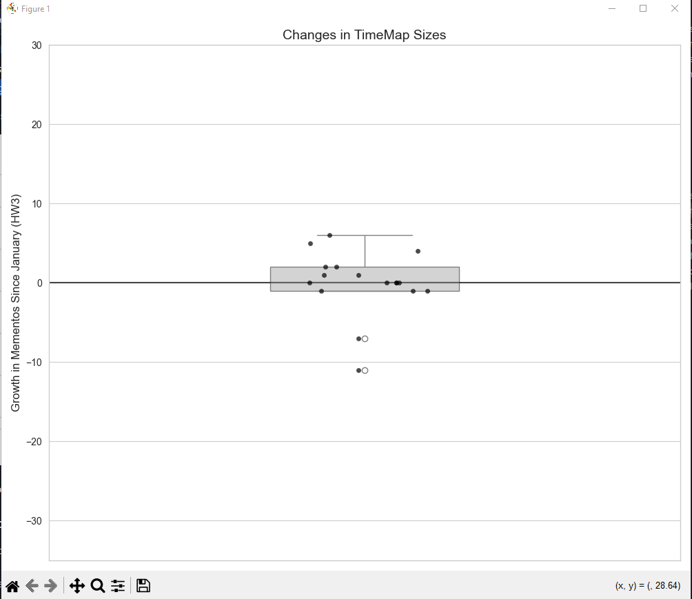

# HW9 - Revisiting Web Archiving, Part 3
### Ethan Novak
### CS 432, Spring 2025
### Sun April 27, 2025 11:59pm

# Q1 Answer
I re-downloaded the 500 TimeMaps from Q1 in HW3, and I ran a local instance of MemGator and that you must use the modified archives.json file. Additionally, I used my original scripts (`getTimeMaps.py` and `mementoSize.py`) to obtain the TimeMaps and determine their size. The scripts can be found in this folder.

Here are the original size of the TimeMaps from HW3:

|Mementos | URI-Rs |
|---------:|--------:|
|1-10 | 241 |
|11-25 | 57 |
| 26-50 | 63 |
| 51-75 | 53 |
| 76-100 | 43 |
| 101-150 | 56 |
| 151-200 | 24 |
| 201-250 | 11 |
| 251-300 | 12 |
| 301-400 | 14 |
| 401-500 | 3 |
| 501-600 | 0 |
| 601-700 | 1 |
| 701-800 | 0 |
| 801-900 | 0 |
| 901-1000 | 0 |
| Over 1000 | 11 |

Below is the new size of the TimeMaps:

|Mementos | URI-Rs |
|---------:|--------:|
|1-10 | 230 |
|11-25 | 63 |
| 26-50 | 65 |
| 51-75 | 46 |
| 76-100 | 48 |
| 101-150 | 60 |
| 151-200 | 23 |
| 201-250 | 13 |
| 251-300 | 12 |
| 301-400 | 13 |
| 401-500 | 3 |
| 501-600 | 1 |
| 601-700 | 1 |
| 701-800 | 0 |
| 801-900 | 0 |
| 901-1000 | 1 |
| Over 1000 | 10 |

After obtaining the new size of the TimeMaps, I created a python script to determine how the size of the TimeMaps have changed. I calculated the difference between the number of mementos in each TimeMap for HW3 and the new set. Furthermore, I ensured that the script correctly handled the following: if a TimeMap has "shrunk" (has fewer mementos now than it did in HW3), it will have a negative value; if it has stayed the same, it will have a "0" value; and if it has grown (has more mementos now than it did in HW3), the value will be positive. Finally, I used Seaborn's `boxplot()` function to graph a boxplot of the differences. 

Below is my script and the graph:

```
import pandas as pd
import numpy as np
import matplotlib.pyplot as plt
import seaborn as sns

plt.style.use('ggplot')
sns.set_style("whitegrid")

hw3_data = {
    '1-10': 241,
    '11-25': 57,
    '26-50': 63,
    '51-75': 53,
    '76-100': 43,
    '101-150': 56,
    '151-200': 24,
    '201-250': 11,
    '251-300': 12,
    '301-400': 14,
    '401-500': 3,
    '501-600': 0,
    '601-700': 1,
    '701-800': 0,
    '801-900': 0,
    '901-1000': 0,
    'Over 1000': 11
}

new_data = {
    '1-10': 230,
    '11-25': 63,
    '26-50': 65,
    '51-75': 46,
    '76-100': 48,
    '101-150': 60,
    '151-200': 23,
    '201-250': 13,
    '251-300': 12,
    '301-400': 13,
    '401-500': 3,
    '501-600': 1,
    '601-700': 1,
    '701-800': 0,
    '801-900': 0,
    '901-1000': 1,
    'Over 1000': 10
}

differences = {}
for key in hw3_data:
    differences[key] = new_data[key] - hw3_data[key]

diff_values = list(differences.values())

plt.figure(figsize=(10, 8))

sns.boxplot(y=diff_values, color='lightgray', width=0.3)

sns.stripplot(y=diff_values, color='black', size=5, alpha=0.7)

plt.ylabel('Growth in Mementos Since January (HW3)', fontsize=12)
plt.title('Changes in TimeMap Sizes', fontsize=14)

plt.axhline(y=0, color='black', linestyle='-', alpha=0.7)

plt.ylim(-35, 30)

plt.tight_layout()
plt.savefig('timemap_changes_boxplot.png', dpi=300)
plt.show()
```



Overall, the differences can be summed up below.

Differences in TimeMap sizes (new - hw3):
1-10: -11
11-25: 6
26-50: 2
51-75: -7
76-100: 5
101-150: 4
151-200: -1
201-250: 2
251-300: 0
301-400: -1
401-500: 0
501-600: 1
601-700: 0
701-800: 0
801-900: 0
901-1000: 1
Over 1000: -1

# Q2 Answer
I repeated Q1 from HW2. First, I re-downloaded the HTML of each webpage; the folder containing these HTML files can be found in this directory (`HW9/raw_html_files`). Second, I removed the boilerplate from each of the raw HTML files; the folder containing the processed HTML files can be found in this directory (`HW9/processed_html_files`). 

Q: Do all 500 URIs still return a "200 OK" as their final response (i.e., at the end of possible redirects)?

A: 

It is important to note that I had a total of 618 HTML files instead of only 500 HTML files. 

To check if the URIs returned a status code of "200 OK" as their final response, I created a python script called `checkStatusCode.py`. The script reads in the URIs found in the file `uri_to_hash_map.txt`, and it checks what the status code of each URI is. The script accomplishes this by using the `requests.get()` function from the `requests` library. Below is the script:

```
import os
import requests

uri_to_hash_map_path = 'uri_to_hash_map.txt'

def read_uri_to_hash_map(file_path):
    url_to_hash_map = {}
    with open(file_path, 'r') as file:
        for line in file:
            parts = line.strip().split()
            if len(parts) == 2:
                url, hash_value = parts
                url_to_hash_map[url] = hash_value
    return url_to_hash_map

def check_url_status(url):
    try:
        response = requests.get(url)
        return response.status_code
    except requests.RequestException as e:
        print(f"Error checking {url}: {e}")
        return None

def main():
    url_to_hash_map = read_uri_to_hash_map(uri_to_hash_map_path)
    
    status_200_count = 0
    non_status_200_count = 0

    for url, hash_value in url_to_hash_map.items():
        status_code = check_url_status(url)
        
        if status_code == 200:
            status_200_count += 1
        else:
            non_status_200_count += 1

    print(f"URLs with status code 200: {status_200_count}")
    print(f"URLs with other status codes: {non_status_200_count}")

if __name__ == '__main__':
    main()
```

After running the script, here is the output:

```
URLs with status code 200: 614
URLs with other status codes: 4
```

Therefore, of the original URIs, only 614 URIs still return a 200 status code. 4 URIs do not return a 200 status code. 


# Q3 Answer
Please mark this question as incorrect. I have done extra credit throughout this semester, so my grade is still good if I don't complete this question.

# Q4 Answer
Please mark this question as incorrect. I have done extra credit throughout this semester, so my grade is still good if I don't complete this question.  
